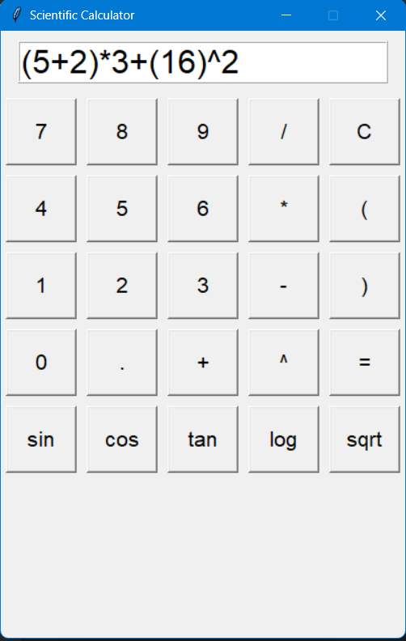

# 🧮 Scientific Calculator (Tkinter GUI)

A sleek and functional **Python Scientific Calculator** built using **Tkinter**.  
It supports both **basic arithmetic** and **scientific functions**, designed with simplicity and clarity in mind.  
Perfect for students, beginners, or developers who want to explore GUI development in Python.

---

## 🚀 Features

✅ **Basic Operations:** `+`, `-`, `×`, `÷`  
✅ **Scientific Functions:** `sin()`, `cos()`, `tan()`, `log()`, `sqrt()`  
✅ **Exponentiation:** `^` (e.g., `2^3 = 8`)  
✅ **Parentheses Support** for complex expressions  
✅ **Error Handling** for invalid inputs  
✅ **Simple & Intuitive Interface** built entirely with Tkinter  

---

## 🧩 Installation

1️⃣ Make sure **Python 3.x** is installed on your system.  
2️⃣ Tkinter is usually included with Python. If not, install it using:

``bash
pip install tk
3️⃣ Clone this repository:

bash
Copy code
git clone https://github.com/YOUR_USERNAME/scientific-calculator.git
4️⃣ Navigate to the project folder:

bash
Copy code
cd scientific-calculator
▶️ Running the App
Option 1 — Run as a Python Script:
bash
Copy code
python scientific_calculator.py
Option 2 — (Optional) Executable for Windows:
If you have the .exe version, simply double-click
ScientificCalculator.exe to launch the app.

🧠 How to Use
1️⃣ Click the on-screen buttons or type directly into the input field.
2️⃣ Use scientific buttons like sin, cos, tan, log, or sqrt() for advanced calculations.
3️⃣ Press = to evaluate.
4️⃣ Press C to clear the input field.
5️⃣ Combine parentheses for complex expressions — for example:

cpp
Copy code
sin(45) + log(100) / (2^3)
🖼️ Preview

🧑‍💻 Author
Created by: Yasser
This project is open-source and can be freely improved or customized.
Contributors are always welcome!

🌟 Future Improvements
🌓 Add Dark / Light Mode toggle

📜 Include Calculation History

💾 Add Memory Buttons (M+, M-, MR)

🔢 Enable Keyboard Input for faster typing

💬 Feedback
If you like this project, don’t forget to ⭐ star the repo on GitHub!
Suggestions and pull requests are always appreciated.

yaml
Copy code

---

Would you like me to make **matching README templates** (same clean style and emojis) for your **Text Analyzer** and **To-Do List Manager** projects too?  
They’ll all look consistent and professional across your GitHub.

